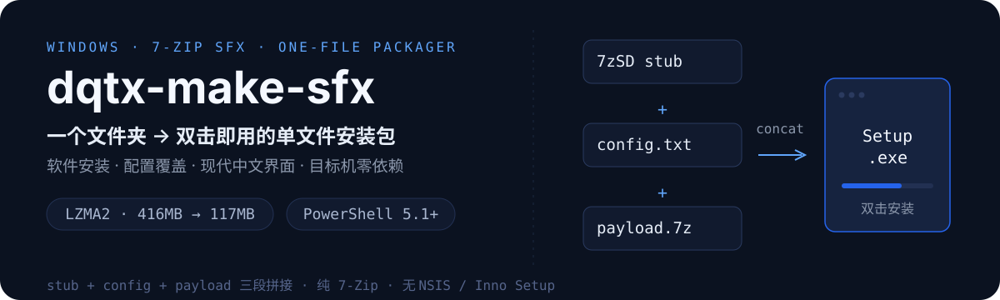
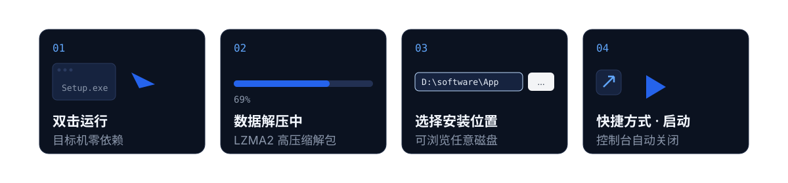

<p align="center">
  
</p>

<p align="center">
  
  
  
  
</p>

**把任意文件夹打成双击即用的单文件 `.exe`**：软件安装包、主题/配置包，一把梭。
纯 7-Zip SFX 方案，不依赖 NSIS / Inno Setup，目标机**什么都不用装**。

> 本仓库同时是一份 [Agent Skill](SKILL.md)（`SKILL.md`），可直接给 Claude Code / WorkBuddy 等
> Agent 使用——Agent 会自动判断「软件安装」还是「配置文件覆盖」并选择对应模式。

## 装好后是什么体验

<p align="center">
  
</p>

- **软件安装**：解压到安装目录 → 创建桌面快捷方式 → 自动启动主程序，控制台自动关闭
- **配置覆盖**：自动定位软件用户目录（如 Typora 主题 → `%APPDATA%\Typora\themes`），强制覆盖旧文件
- **现代中文界面**：无边框自绘标题栏 + 横幅 + 应用名高亮 + 路径选择（可浏览换任意盘）
- **单文件分发**：LZMA2 高压缩（实测 416MB Electron 应用 → 117MB），解码器编译进 stub

安装界面的横幅素材示例：`assets/banner-demo.png`。界面里的徽章、文件夹、绿勾均为运行时绘制，**模板零内置图片**。

## 快速开始

### 1. 拿到安装器 stub `7zSD.sfx`

它不在 7-Zip 安装目录里，在官方 **LZMA SDK** 中：

```powershell
# 下载 https://www.7-zip.org/a/lzma2602.7z ，解出 bin/7zSD.sfx
& "C:\Program Files\7-Zip\7z.exe" x -y -o<sdk目录> lzma2602.7z "bin/*"
```

> ⚠️ `C:\Program Files\7-Zip\7z.sfx` **完全不读 config.txt**（实测 + 源码确认），
> 只能做"解压到当前目录"。要自动运行 / 标题 / 路径选择，必须用 SDK 里的 `7zSD.sfx`。

### 2.（可选）界面中文化

```powershell
python scripts/localize_stub.py <sdk目录>\bin\7zSD.sfx
# 就地替换：Extracting→数据解压中、Extraction Failed→解压失败 等四处
```

### 3. 打一个软件安装包

```powershell
# 从主程序提取软件自己的图标作为安装包图标
python scripts/extract_icon.py "D:\build\MyApp\MyApp.exe" app.ico

# 打包：装到 D:\software\MyApp + 建桌面快捷方式 + 自动启动
powershell -ExecutionPolicy Bypass -File scripts\build_sfx.ps1 `
  -Stub <sdk目录>\bin\7zSD-zh.sfx -Icon app.ico `
  -AddItems "你的install.cmd","D:\build\MyApp-win32-x64" `
  -Output "$env:USERPROFILE\Desktop\MyApp-Setup.exe" `
  -Title "MyApp 安装程序" -RunProgram "install.cmd"
```

`install.cmd`、安装向导 UI（`wizard.ps1`）、快捷方式与启动逻辑的现成模板都在 `scripts/`，改两行就能用。

### 4. 打一个配置包（覆盖安装）

```powershell
# install_config.cmd 里把 DST 写成 %APPDATA%\Typora\themes
powershell -ExecutionPolicy Bypass -File scripts\build_sfx.ps1 `
  -Stub <sdk目录>\bin\7zSD-zh.sfx `
  -AddItems "scripts\install_config.cmd","D:\my-theme" `
  -Output "Theme-Setup.exe" -RunProgram "install_config.cmd"
```

覆盖是强制的：`robocopy /IS /IT`（不加会跳过相同文件，覆盖不干净）。

### 5.（可选）固定你的默认图标 / stub

```powershell
Copy-Item scripts\sfx-defaults.example.txt scripts\sfx-defaults.txt
# 编辑 sfx-defaults.txt，填上你的 .ico 和 7zSD stub 路径，以后打包自动带上
```

## 目录结构

```
dqtx-make-sfx/
├── SKILL.md                     # Agent Skill 清单（给 AI 看的完整操作手册）
├── assets/
│   ├── banner-demo.png          # 横幅示例（裁边后）
│   └── readme/                  # README 视觉素材（hero / workflow SVG 源文件）
├── scripts/
│   ├── build_sfx.ps1            # 主打包脚本（压缩→config→盖章图标→三段拼接）
│   ├── wizard.ps1               # 现代扁平安装向导 UI（无边框标题栏+横幅+路径选择）
│   ├── install_config.cmd       # 配置包安装模板（环境变量定位 + 强制覆盖）
│   ├── crop_banner.ps1          # 裁掉横幅设计稿四周白边
│   ├── stamp_icon.ps1           # 给任意 PE 盖 .ico 图标（kernel32 原生）
│   ├── extract_icon.py          # 从主程序 exe 提取多尺寸 .ico（软件包图标默认来源）
│   ├── localize_stub.py         # 7zSD 界面文字中文化（改 PE RT_STRING 表）
│   ├── choose_path.ps1          # 极简路径选择框（无横幅变体）
│   ├── sfx-defaults.example.txt # 本地默认值模板（复制为 sfx-defaults.txt 使用）
│   └── sfx-defaults.txt         # 你的个人默认值（已 gitignore，不入库）
└── .gitignore
```

## 踩坑速查（全部实测踩过，详见 SKILL.md）

| 坑 | 结论 |
|---|---|
| Program Files 的 `7z.sfx` 忽略 config.txt | 用 LZMA SDK 的 `7zSD.sfx` |
| `Directory=` 不是解压路径 | 是 `RunProgram` 的前缀，默认 `.\` 别动它 |
| 图标必须先盖后拼接 | `UpdateResource` 把 PE 大小当 EOF，会截掉 appended payload |
| 盖章语言 ID 要匹配 stub | 否则资源管理器里图标时灵时不灵（两份 GROUP_ICON） |
| config.txt / .ps1 必须 UTF-8 BOM | 缺 BOM 中文乱码 / config 整体失效 |
| `New-Object Point(x, $y + N)` | 逗号优先级高于 `+`，先算进变量再传 |
| 横幅白边造成"界面有缝" | 先跑 `crop_banner.ps1` |

## License

[MIT](LICENSE) © [DQTX (dqtx760)](https://github.com/dqtx760)

## 👨‍💻 关于我

**大强同学（Derek Zhao）**
AI 工具与工作流实践者 · GitHub 开源项目作者

我在 Windows、AI Agent、Obsidian 和个人网站这些真实场景里，
把能跑通的工具、Skill 和流程，整理成可复用的开源项目与交付方案。

- 文章与工具：[dqtx.cc](https://www.dqtx.cc/) · [os.dqtx.cc](https://os.dqtx.cc/) · [blog.dqtx.cc](https://blog.dqtx.cc/)
- 关注更新：[B 站](https://space.bilibili.com/491358682/upload/video) · [YouTube](https://www.youtube.com/@dqtx760/videos) · [即刻](https://web.okjike.com/u/24236868-c3e9-49ef-ab93-93a60e1a25db) · [CSDN](https://blog.csdn.net/2402_82616859?type=blog)
- 公众号：微信搜索「大强同学」

<p align="center">
  
</p>

卡在安装、配置、报错，或想把 AI 接进自己的工作流，可以直接找我。

<p align="center">
  <a href="https://github.com/oil-oil/beautify-github-readme"></a>
</p>
